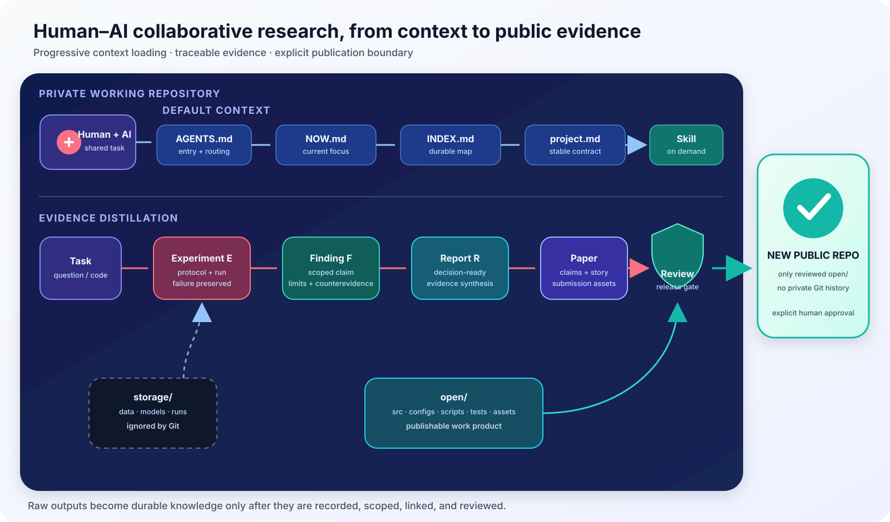

<p align="right"><a href="README.md">中文</a> · <strong>English</strong></p>

# Co-Research Lab

> A GitHub-first workspace template for human–AI collaborative research.

<p align="center">
  
</p>

Co-Research Lab uses a lightweight directory structure and working agreement to connect code, experiments, findings, reports, and research context. It is not a fixed platform or heavyweight framework: each project can gradually add its own context, skills, and harnesses as real needs emerge.

## What it addresses

- An AI agent should not scan the entire repository whenever it enters a project.
- Experimental outputs should not disappear into terminals, chats, or temporary run directories.
- Findings, failures, and decisions should remain traceable to evidence.
- Material for updates, papers, and releases should accumulate from day one.
- Private research memory and public deliverables need an unambiguous boundary.

## Two core flows

AI loads the minimum context first:

```text
AGENTS.md
  → research/NOW.md
  → research/INDEX.md
  → .agents/context/project.md
  → task-specific context / skill / record
```

Research artifacts are progressively distilled along an evidence chain:

```text
storage/runs/... → experiment E### → finding F### → report R###
                                                   → paper claim
                                                   → reviewed open/ release
```

<p align="center">
  
</p>

## Repository structure

```text
.
├── README.md / README.en.md
├── AGENTS.md                    # AI entry point and working agreement
├── open/                        # the only source allowed into a public repo
│   ├── src/
│   ├── configs/
│   ├── scripts/
│   ├── tests/
│   └── assets/
├── research/                    # private, Git-tracked research memory
│   ├── NOW.md                   # current objective, state, and next action
│   ├── INDEX.md                 # durable record map
│   ├── LOG.md                   # append-only decision log
│   ├── experiments/             # E###: what was done and how to reproduce it
│   ├── findings/                # F###: what the evidence supports
│   ├── reports/                 # R###: decision- or publication-oriented synthesis
│   ├── literature/
│   └── paper/
├── .agents/                     # AI-native work layer
│   ├── context/                 # stable project conventions
│   ├── skills/                  # task procedures loaded on demand
│   └── harness/                 # deterministic lightweight checks
├── storage/                     # data, models, and runs; ignored by Git
└── _trash/                      # disposable content; ignored by Git
```

## Getting started

1. Create a **private** working repository from this template.
2. Fill in [`.agents/context/project.md`](.agents/context/project.md) with the research question, evaluation contract, and technical conventions.
3. Set the current objective and success criterion in [`research/NOW.md`](research/NOW.md).
4. Have humans and agents follow [`AGENTS.md`](AGENTS.md) instead of scanning the repository by default.
5. Run the structural check:

```bash
python3 .agents/harness/check_workspace.py
```

## How records mature

- An **Experiment** records the question, protocol, command, environment, result, and failure modes.
- A **Finding** connects one scoped conclusion to experimental or literature evidence, including counterevidence and limitations.
- A **Report** assembles findings for a milestone, decision, collaborator update, or submission.
- A **Paper claim** enters the narrative only after its evidence and limitations are explicit.
- An **Open release** receives only human-reviewed, publishable, reproducible material.

Example directories use `_template/`, so they never consume real `E###`, `F###`, or `R###` identifiers.

## Private and public boundary

The working repository should remain private from its creation:

- `research/` is tracked in private Git history.
- `storage/` and `_trash/` are ignored by default.
- `open/` is the sole public-release source, but completing work never publishes it automatically.
- For release, copy the **contents** of `open/` into a brand-new public repository. Never turn the working repository itself public.

Deleting private files from Git does not erase their history, so this boundary must be enforced from day one.

## Extending the workspace

- Put stable project knowledge in `.agents/context/`.
- Put repeatable task procedures in `.agents/skills/<name>/SKILL.md`.
- Put checks with objective pass/fail contracts in `.agents/harness/`.
- Keep research evidence in `research/`; do not turn `.agents/` into a second research notebook.

The template includes four minimal skills—`run-experiment`, `analyze-experiment`, `review-literature`, and `prepare-release`—which projects can refine or replace over time.
